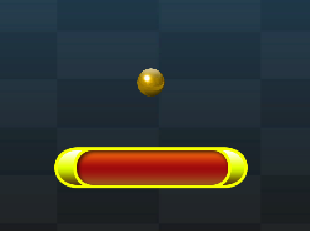

# 🧱 Brick Breaker – Unity 6 (C#)

A classic **2D Brick Breaker game** built using **Unity 6 and C#**, showcasing gameplay programming, physics-based ball movement, collision handling, UI, VFX & SFX.

---

## 🎮 Gameplay Preview

https://github.com/user-attachments/assets/YOUR_GAMEPLAY_VIDEO_LINK

---

## 🖼️ Game Screenshots

| Paddle | Ball | Winning Panel |
|--------|------|--------------|
|  |  |  |

---

## ✨ Features

- Built in **Unity 6**
- Gameplay logic written in **C#**
- **Physics-based ball collision**
- **Paddle movement controls**
- Score tracking system
- **VFX & SFX for brick hits**
- Win & Game Over UI Panels
- Portfolio-ready structured project

---

## 🧠 What This Project Demonstrates

- Unity 2D Physics
- Gameplay Architecture
- Collision Detection
- UI System Integration
- Game State Handling
- C# Scripting & Optimization

---

## 📁 Project Structure

